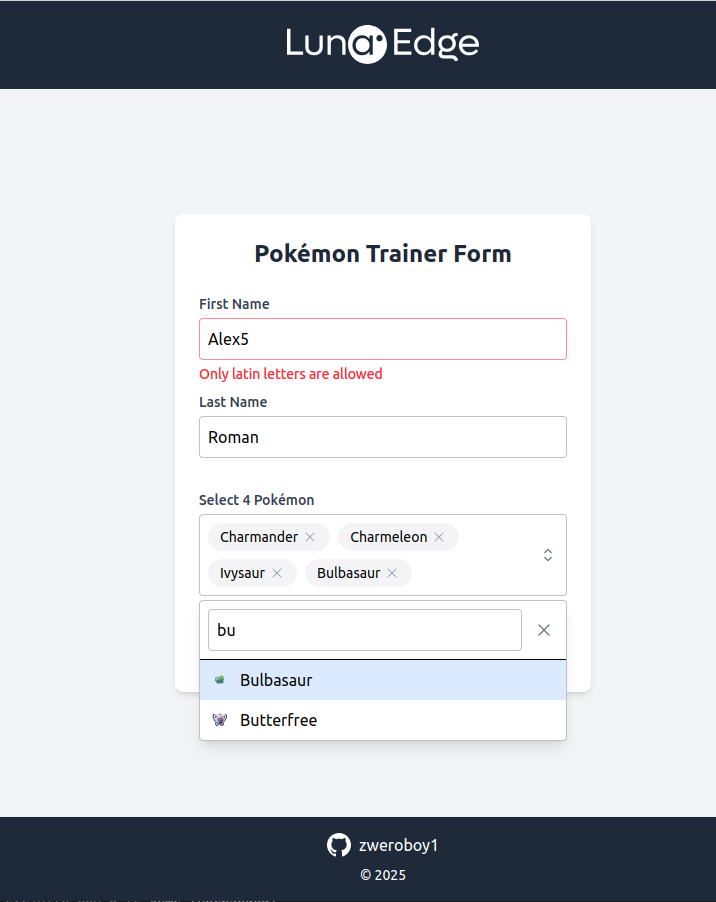
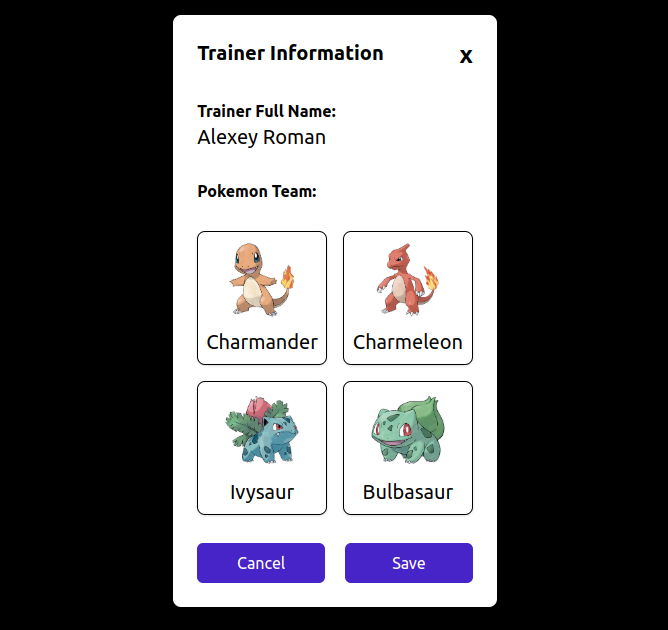

# Pokémon Trainer Form

## Overview

This is a simple Pokémon trainer form application where users can:
1. Enter their first name and last name.
2. Select a team of 4 Pokémon from a dropdown list.
3. View their selected Pokémon team in a modal.

The application is built using modern web technologies and follows best practices for form validation, state management, and component design.

---

## Live Demo

You can try the application here: [Pokémon Trainer Form](https://zweroboy1-pokemon-form.netlify.app/)

---

## Features

- **Form Inputs**: Users can enter their first name and last name.
- **Pokémon Select Component**: A dropdown with search functionality to select up to 4 Pokémon.
- **Modal**: Displays the selected Pokémon team with sprites.
- **Validation**:
  - First name and last name must be between 2 and 12 characters and contain only letters (a-z, A-Z).
  - Exactly 4 Pokémon must be selected.
- **Responsive Design**: The application is fully responsive and works on all screen sizes.

---

## Screenshots

### Form Page



### Modal with Selected Pokémon



---

## Technologies Used

- **React**: A JavaScript library for building user interfaces.
- **TypeScript**: Adds static typing to JavaScript for better code quality.
- **Tailwind CSS**: A utility-first CSS framework for styling.
- **Axios**: A promise-based HTTP client for making API requests.
- **React Hook Form**: A library for managing form state and validation.
- **Storybook**: A tool for building and documenting UI components in isolation.
- **Heroicons**: A set of free MIT-licensed high-quality SVG icons.

---

## API

The application fetches Pokémon data from the [PokéAPI](https://pokeapi.co/). Specifically, it retrieves a list of Pokémon with their names and sprites.

---

## Installation

1. Clone the repository:

```bash
git clone https://github.com/zweroboy1/pokemon-form.git
```

2. Install dependencies:

```bash
yarn install
```

3. Run the application:

```bash
yarn dev
```

4. Build the application:

```bash
yarn build
```

## How to Use

1. Fill in your first name and last name.
2. Click the "Select Pokémon" dropdown to choose your team of 4 Pokémon.
3. Click "Submit" to view your selected team in a modal.

---

## License

This project is licensed under the MIT License. See the [LICENSE](LICENSE) file for details.

---

## Acknowledgments

- [PokéAPI](https://pokeapi.co/) for providing Pokémon data.
- [Heroicons](https://heroicons.com/) for the icons.
- [Tailwind CSS](https://tailwindcss.com/) for the styling framework.
- [Storybook](https://storybook.js.org/) for component documentation.
- [DeepSeek](https://deepseek.com/) for AI help.

---

## Author

[Oleksii Roman](https://github.com/zweroboy1)
